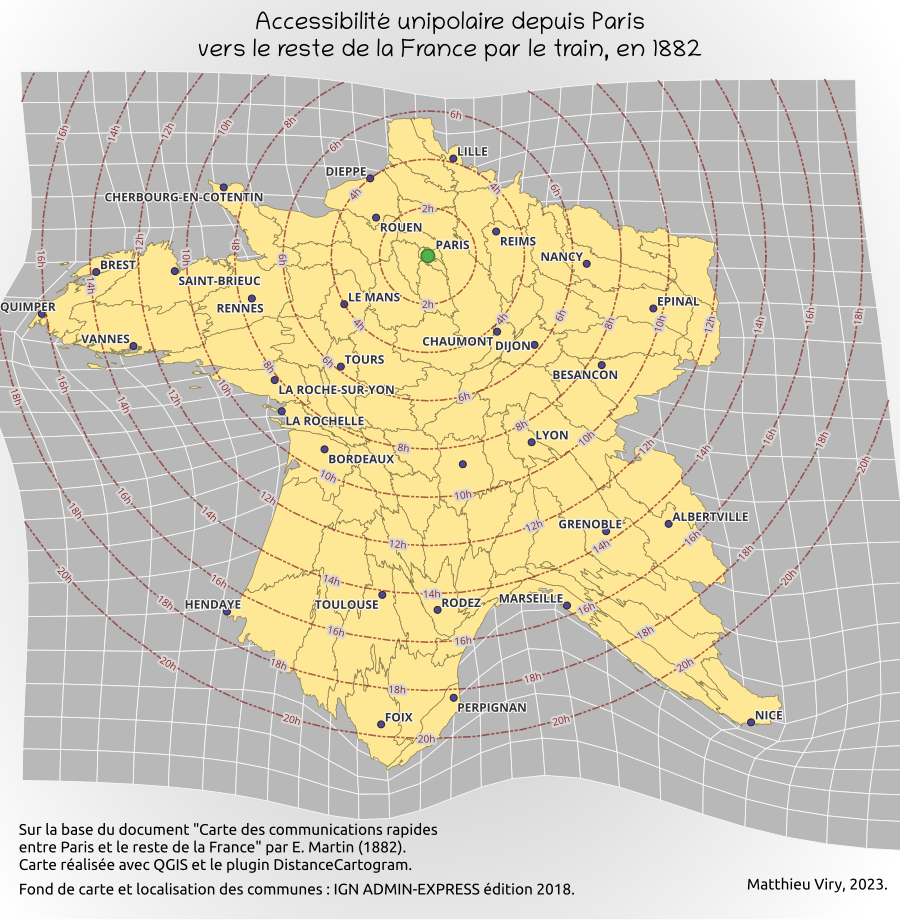

## QgisDistanceCartogramPlugin

**DistanceCartogram QGIS plugin** aims to create what is often defined as a **distance cartogram**.

This is done by showing (on background(s) layer(s), such as the territorial divisions of the study zone) the local
deformations (calculated using Waldo Tobler's bidimensional regression) to fit image points to source points.

The relation between the source points and the image points must depend on the studied theme: positions in access time or estimated positions in spatial cognition for example.

**DistanceCartogram QGIS plugin** is currently available in two languages (English and French) and allows you to create distance cartograms in two ways:

* by providing a **layer of points** and a **time matrix between them** (used to create the image points layer)
* by providing **2 layers of related points** : the source points and the image points.

Note:
> This is a [Darcy](https://sourcesup.renater.fr/www/transcarto/darcy/) port regarding to the bidimensional regression and the backgrounds layers deformation.  
All credits for the contribution of the method goes to **Colette Cauvin** *(Théma - Univ. Franche-Comté)* and for the reference Java implementation goes to **Gilles Vuidel** *(Théma - Univ. Franche-Comté)*.
