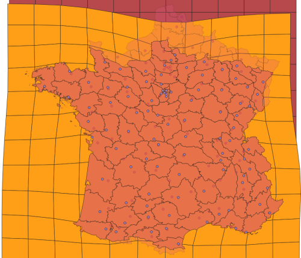

## QgisDistanceCartogramPlugin

**DistanceCartogram QGIS plugin** aims to create what is often defined as a **distance cartogram**.

This is done by showing (on background(s) layer(s), such as the territorial divisions of the study zone) the local
deformations (calculated using Waldo Tobler's bidimensional regression) to fit image points to source points.

The relation between the source points and the image points must depend on the studied theme: positions in access time or estimated positions in spatial cognition for example.

**DistanceCartogram QGIS plugin** is currently available in two languages (English and French) and allows you to create distance cartograms in two ways:

* by providing a **layer of points** and a **time matrix between them** (used to create the image points layer)
* by providing **2 layers of related points** : the source points and the image points.

Note:
> This is a [Darcy](https://thema.univ-fcomte.fr/productions/software/darcy/) port regarding to the bidimensional regression and the backgrounds layers deformation.  
All credits for the contribution of the method goes to **Colette Cauvin** *(Théma - Univ. Franche-Comté)* and for the reference Java implementation goes to **Gilles Vuidel** *(Théma - Univ. Franche-Comté)*.

## Installation

This plugin is available in the official [QGIS plugin repository](https://plugins.qgis.org/plugins/dist_cartogram/).

To install the plugin, you can use the QGIS plugin manager and simply search for `DistanceCartogram`.

## Instruction for developers

To install the plugin for development, you can clone the repository and manage the various actions with the `Makefile` provided.

Note that you need to have:
- pyqt5-dev-tools installed (`sudo apt install pyqt5-dev-tools`) to use the `pyrcc5` command,
- sphinx installed (`pip install sphinx` or `sudo apt install python3-sphinx`) to generate the documentation.

## License

[GPL-3.0](LICENSE).
