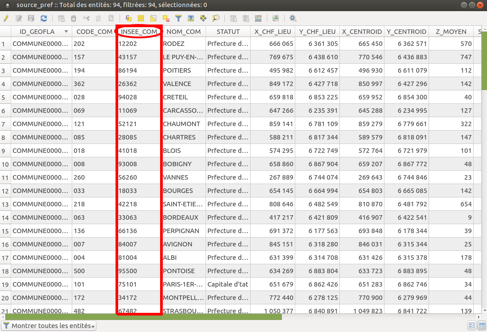
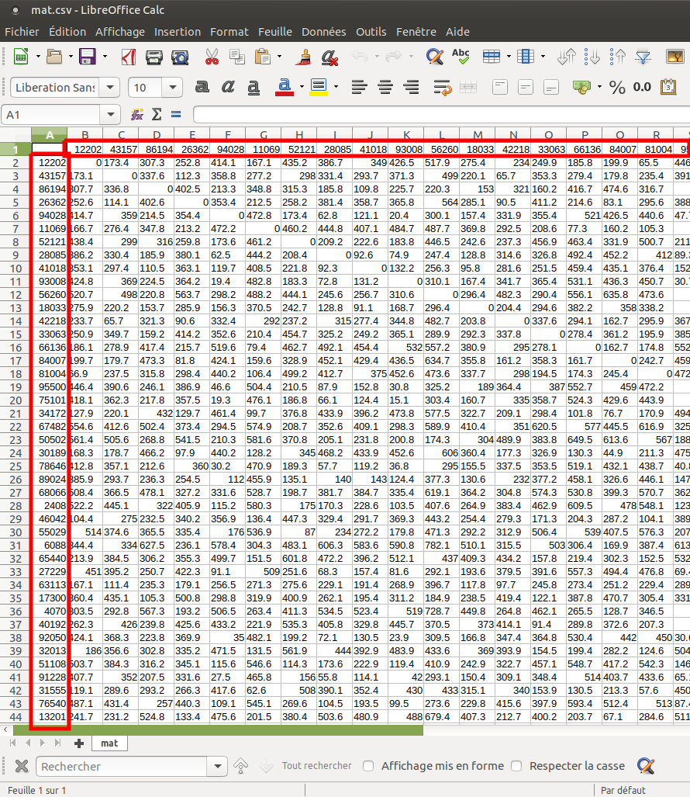

.. DistCartogram documentation master file, created by
   sphinx-quickstart on Sun Feb 12 17:11:03 2012.
   You can adapt this file completely to your liking, but it should at least
   contain the root `toctree` directive.

DistCartogram QGIS Plugin Documentation
============================================

.. toctree::
   :maxdepth: 2

.. index:: Introduction

Introduction
=================
DistCartogram aims to create what is often defined as a **distance cartogram**.

This is done by showing (on background(s) layer(s), such as the territorial divisions of the study zone) the local
deformations (calculated using Waldo Tobler's bidimensional regression) to fit image points to source points.

The relation between the source points and the image points must depend on the studied theme: positions in access time or estimated positions in spatial cognition for example.

DistCartogram QGIS plugin allows to create distance cartograms in two ways:

* by providing a **layer of points** and a **time matrix between them** (used to create the image points layer)
* by providing **2 layers of related points** : the source points and the image points.

Notes:

* This is a Darcy port regarding to the bidimensional regression and the backgrounds layers deformation. All credits for the contribution of the method goes to *Colette Cauvin* and for the reference implementation goes to *Gilles Vuidel*.
* The way the points are moved (detailed below) from the time matrix is quite simple and is based on my readings and my understanding of the phenomenon. Other methods exists and could be implemented (both in this plugin or by the user while preparing its dataset).

.. image:: img/screenshot500.png

.. index:: Data

Expected data
=================

Example 1:
..........
- by providing a **layer of points** and a **time matrix between them**:

Example 2:
..........
- by providing the source points layer and the image points layer:

.. index:: References

References
=================

Indices and tables
==================

* :ref:`genindex`
* :ref:`modindex`
* :ref:`search`
