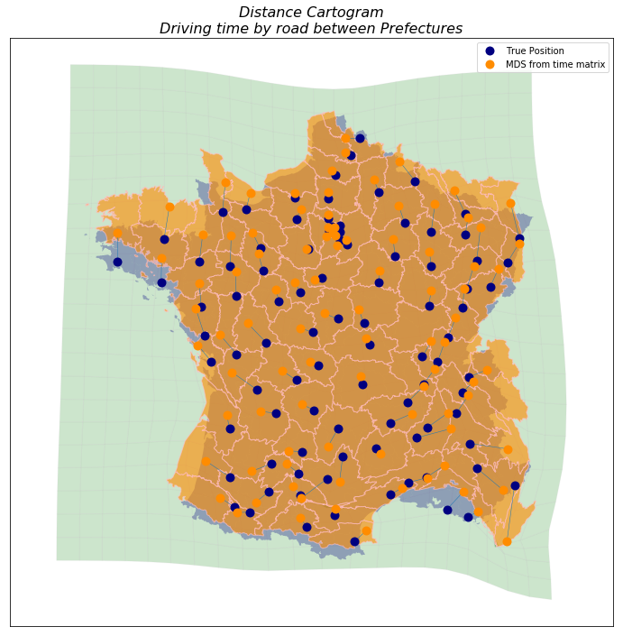

.. DistanceCartogram documentation master file, created by
   sphinx-quickstart on Sun Feb 12 17:11:03 2012.
   You can adapt this file completely to your liking, but it should at least
   contain the root `toctree` directive.

DistanceCartogram QGIS Plugin Documentation
============================================

.. toctree::
   :maxdepth: 2

.. index:: Introduction

Introduction
=================
DistanceCartogram aims to create what is often defined as a **distance cartogram**.

This is done by showing (on background(s) layer(s), such as the territorial divisions of the study zone) the local
deformations (calculated using Waldo Tobler's bidimensional regression) to fit image points to source points.

The relation between the source points and the image points must depend on the studied theme: positions in access time or estimated positions in spatial cognition for example.

**DistanceCartogram QGIS plugin** allows to create distance cartograms in two ways:

* by providing a **layer of points** and a **time matrix between them** (used to create the image points layer)
* by providing **2 layers of related points** : the source points and the image points.

Notes:

* This is a Darcy_ port regarding to the bidimensional regression and the backgrounds layers deformation. All credits for the contribution of the method goes to *Colette Cauvin* and for the reference implementation goes to *Gilles Vuidel*.
* The way the points are moved from the time matrix is quite simple and is explained below. Other methods exists and could be implemented (both in this plugin or by the user while preparing its dataset).

.. image:: img/screenshot500.png
  :align: center

.. _Darcy: http://thema.univ-fcomte.fr/production/logiciels/16-categories-en-francais/cat-productions-fr/cat-logiciels-fr/294-art-darcy
.. _Multidimensional scaling (MDS): https://en.wikipedia.org/wiki/Multidimensional_scaling

.. index:: Data

Expected data
=================

Example 1
^^^^^^^^^
- by providing a **layer of points** and a **time matrix between them**:

.. figure:: img/source_point_table.png
  :figwidth: 50%
  :align: center

  The source point layer must contain an unique identifier field. These identifiers must match with those used in the matrix.

Example 2
^^^^^^^^^
- by providing the source points layer and the image points layer:

.. figure:: img/from_2_points_layers.png
  :figwidth: 60%
  :align: center

  The source points layer (source_pref, the real location of the prefecture) and the image points layer (image_pref, the computed location of the prefecture given some time-distance data).

  These two layers must have a field containing an unique identifier to match them (here INSEE_COM in both layers).

.. index:: Displacement

Points displacement from time matrix
=========================================

The method we propose allows the use of a travel time matrix to move the points of the dataset around a reference point (whose location will remain unchanged).
The calculation for calculating the new position of the points is done in several steps:

* Calculation of the Euclidean distance between the reference point (*labeled* **64445** *in our example*) and each of the other points.
* Use of travel times and this distance to calculate a speed between the reference point and each of the other points
* Calculation of the average speed
* Calculation of a displacement coefficient to be applied to each point: the ratio between the speed associated with each point and the average speed

  The source dataset with the reference point: **64445**.

  Selection of the feature **64445** as reference point in :guilabel:`DistanceCartogram` interface.

  The points are moved according to their travel time from the reference point. Some points of this "image" layer are closer, others are farther from the reference point.

  Points with a speed greater than the mean speed are getting closer, other are getting farther.

  Using this method, all displacement vectors have the reference point as their origin or destination (depending on whether their speed is above or below the average speed).

  The "displacement factor" option allows to apply a coefficient to the displacement of the points: with a factor of 2 the displacement of the point will be 2 times greater than with a factor of 1; conversely with a factor of 0.5 the displacement will be 2 times less important.

  The background layer is deformed according to the movement of the control points.

Depending on the thematic needs related to the realization of a distance cartogram, other methods may be considered for moving points.
For example, it might be possible to use the entire travel time matrix to move all points in the dataset (no use of a reference point) with methods such as `Multidimensional scaling (MDS)`_ (example below using the travel time matrix provided in example).

.. index:: References

References
=================

Indices and tables
==================

* :ref:`genindex`
* :ref:`modindex`
* :ref:`search`
